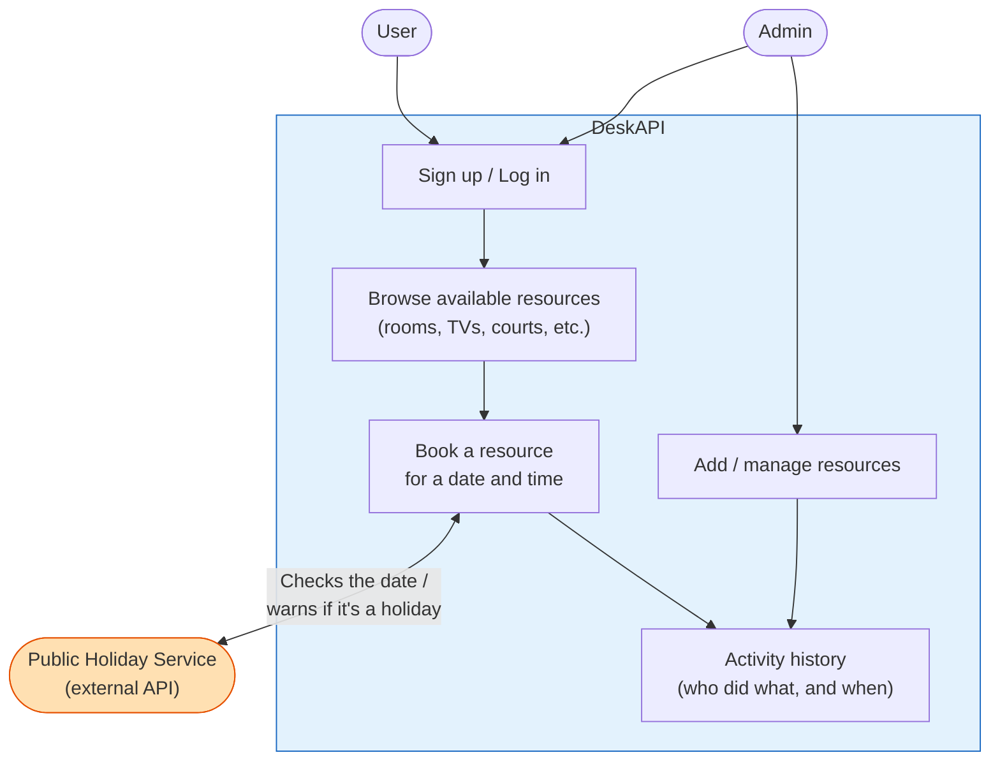
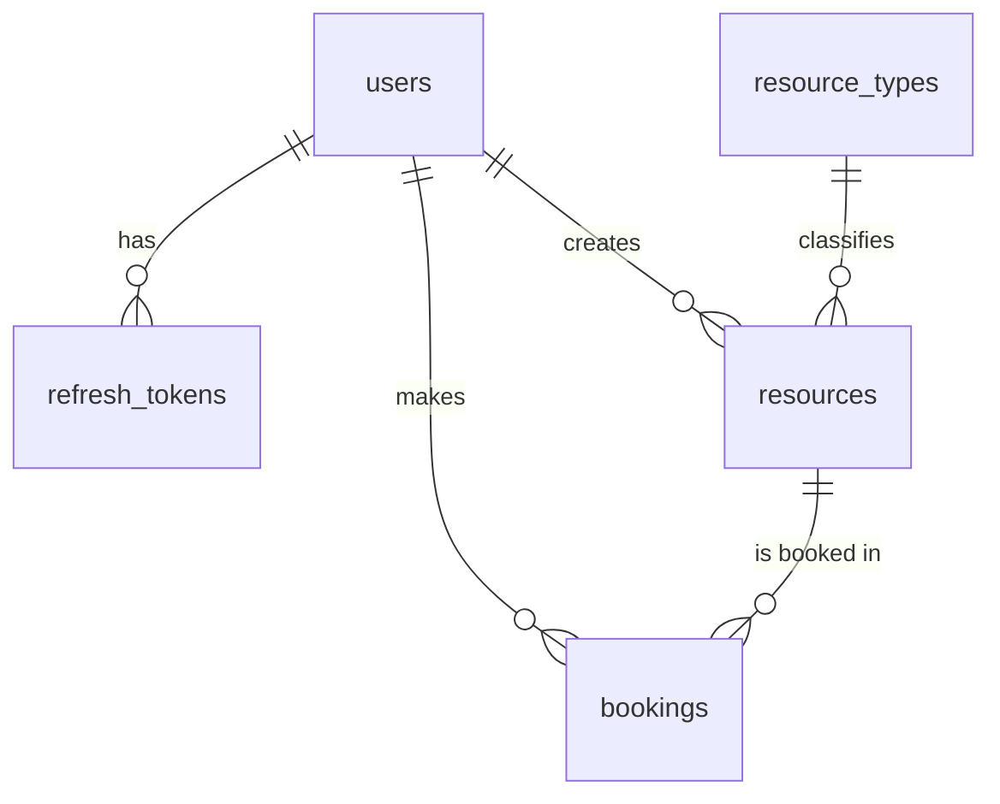

# DeskAPI — Project Overview

## What is it?
**DeskAPI** is a backend system (REST API) for booking shared resources — meeting rooms, TVs, sports courts, equipment, etc. — preventing schedule conflicts and centralizing availability in one place. The frontend is not a priority; the focus is 100% backend/API.

## What is it for?
- Let users book resources without time conflicts.
- Let admins manage which resources exist and their details (capacity, location, etc.).
- Keep a history/audit log of what happens in the system (who booked what, who created a resource, logins).
- Warn users when a booking falls on a public holiday, using an external API.

## How does it work? (Diagram)



**In simple terms:** users log in, browse resources, and book them. Admins manage which resources exist. Every booking or resource change is recorded in the activity history. Before confirming a booking, DeskAPI checks a free external service to see if that day is a public holiday and warns the user.

## Architecture — 3 services

| Service | Responsibility | Database |
|---|---|---|
| `auth-service` | Sign up / log in, JWT (short-lived access token + refresh token), roles (admin/user) | PostgreSQL |
| `reservation-service` | Resources and bookings, no-overlap scheduling rule | PostgreSQL |
| `activity-service` | Logs / audit trail / notifications | MongoDB |

**Stack:** Node.js + Express, PostgreSQL, MongoDB, Docker / Docker Compose, GitHub, REST API documented with Swagger.

## Database — PostgreSQL (5 tables)

```sql
-- 1. Users
CREATE TABLE users (
    id SERIAL PRIMARY KEY,
    name VARCHAR(100) NOT NULL,
    email VARCHAR(150) UNIQUE NOT NULL,
    password_hash VARCHAR(255) NOT NULL,
    role VARCHAR(20) NOT NULL DEFAULT 'user',  -- 'admin' | 'user'
    status VARCHAR(20) NOT NULL DEFAULT 'active',
    created_at TIMESTAMP NOT NULL DEFAULT NOW()
);

-- 2. Refresh tokens (for logout / session revocation)
CREATE TABLE refresh_tokens (
    id SERIAL PRIMARY KEY,
    user_id INTEGER NOT NULL REFERENCES users(id),
    token_hash VARCHAR(255) NOT NULL,
    expires_at TIMESTAMP NOT NULL,
    revoked BOOLEAN NOT NULL DEFAULT FALSE,
    created_at TIMESTAMP NOT NULL DEFAULT NOW()
);

-- 3. Resource type catalog (auto find-or-create)
CREATE TABLE resource_types (
    id SERIAL PRIMARY KEY,
    name VARCHAR(100) UNIQUE NOT NULL,
    description TEXT,
    created_at TIMESTAMP NOT NULL DEFAULT NOW()
);

-- 4. Resources (rooms, TVs, courts, etc.)
CREATE TABLE resources (
    id SERIAL PRIMARY KEY,
    name VARCHAR(150) NOT NULL,
    description TEXT,
    type_id INTEGER NOT NULL REFERENCES resource_types(id),
    location VARCHAR(150),
    status VARCHAR(20) NOT NULL DEFAULT 'available',
    attributes JSONB,  -- type-specific fields: capacity, screen size, etc.
    created_by INTEGER NOT NULL REFERENCES users(id),
    created_at TIMESTAMP NOT NULL DEFAULT NOW()
);

-- 5. Bookings
CREATE TABLE bookings (
    id SERIAL PRIMARY KEY,
    user_id INTEGER NOT NULL REFERENCES users(id),
    resource_id INTEGER NOT NULL REFERENCES resources(id),
    start_time TIMESTAMP NOT NULL,
    end_time TIMESTAMP NOT NULL,
    status VARCHAR(20) NOT NULL DEFAULT 'confirmed',
    created_at TIMESTAMP NOT NULL DEFAULT NOW(),
    CONSTRAINT check_time_order CHECK (end_time > start_time)
);
```

### Entity relationship diagram



## Database — MongoDB (1 collection)

Used only by `activity-service`, to keep a simple history of important events (resource created, booking made, booking canceled, login).

**Collection: `logs`**

```json
{
  "event": "booking_created",
  "user_id": "u123",
  "date": "2026-08-07T10:00:00Z",
  "message": "User Daniel created a booking for Meeting Room 4"
}
```

| Concept | In DeskAPI |
|---|---|
| Collection | `logs` (single collection) |
| Fields | `event`, `user_id`, `date`, `message` |
| Purpose | Simple history of "what happened and who did it" |
| Complexity | Minimal — insert, read, and optionally delete |

## External API — Public Holidays

**Nager.Date Holiday API** — free, no authentication required, no rate limits.

- Docs: https://nagerholidays.com/api
- Endpoint: `GET https://nagerholidays.com/api/v4/Holidays/{CountryCode}/{Year}`

Example response:
```json
[
  { "date": "2026-01-01", "name": "New Year's Day", "nationalHoliday": true },
  { "date": "2026-04-03", "name": "Good Friday", "nationalHoliday": true }
]
```

### Integration flow
1. A user tries to create a booking (`POST /api/bookings`).
2. `reservation-service` calls the Holiday API with the country and year of the booking date.
3. If the date is a public holiday, the user gets a warning (or the booking is blocked, depending on the business rule chosen).
4. The event is recorded in `activity-service` (`logs` collection), noting whether it happened on a holiday.

## Key design decisions
- Only the `admin` role can create resources; creating one auto find-or-creates its `resource_type`.
- `resources.attributes` is JSONB to hold type-specific fields (capacity, screen size, etc.) without NULL-heavy columns or migrations.
- The JWT access token is stateless and never stored in the database.
- The refresh token IS stored, but hashed, so sessions can be revoked (logout).
- CORS must be configured on each of the 3 services (or centralized via an API Gateway), explicitly allowing the `Authorization` header.
- General philosophy: keep everything as simple as possible — avoid over-engineered patterns.

## Project status
Data model (PostgreSQL + MongoDB) is closed. Still pending: full API contracts, folder structure, Docker Compose setup, and the GitHub repository. The code workspace has not been scaffolded yet.
